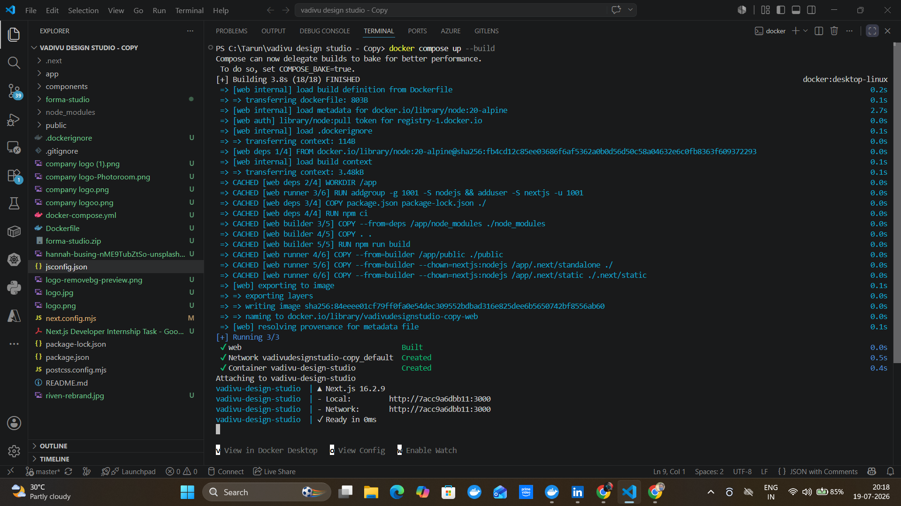
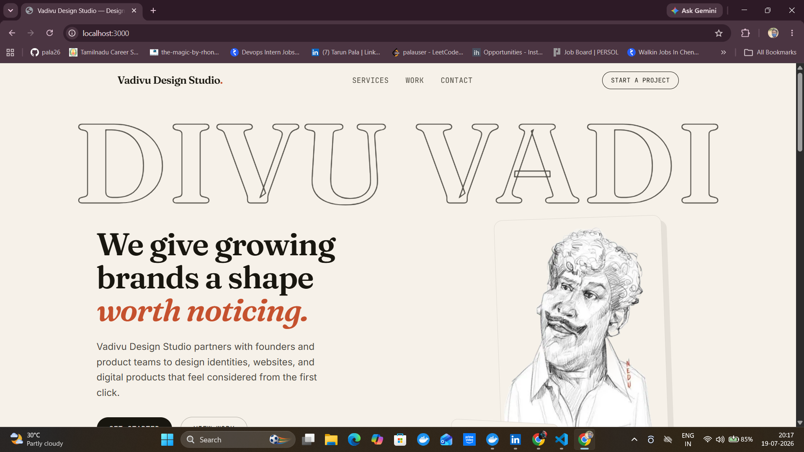
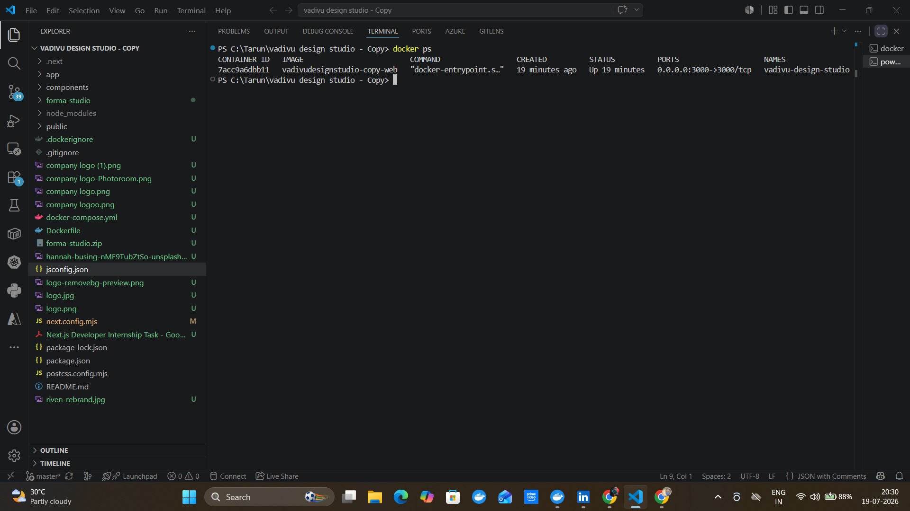
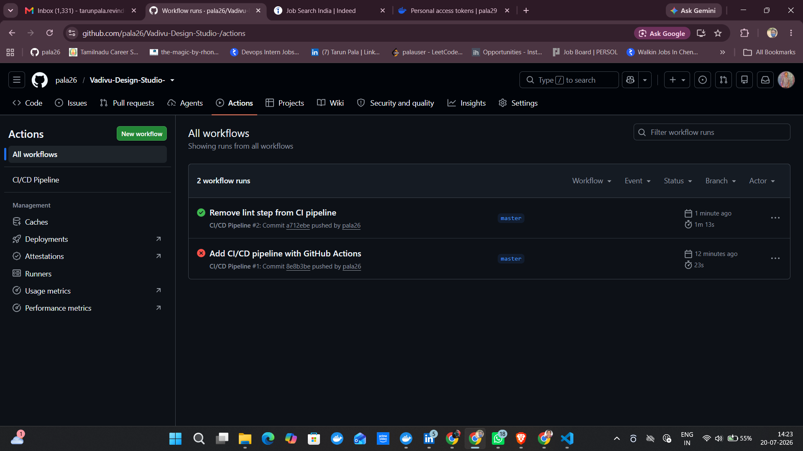
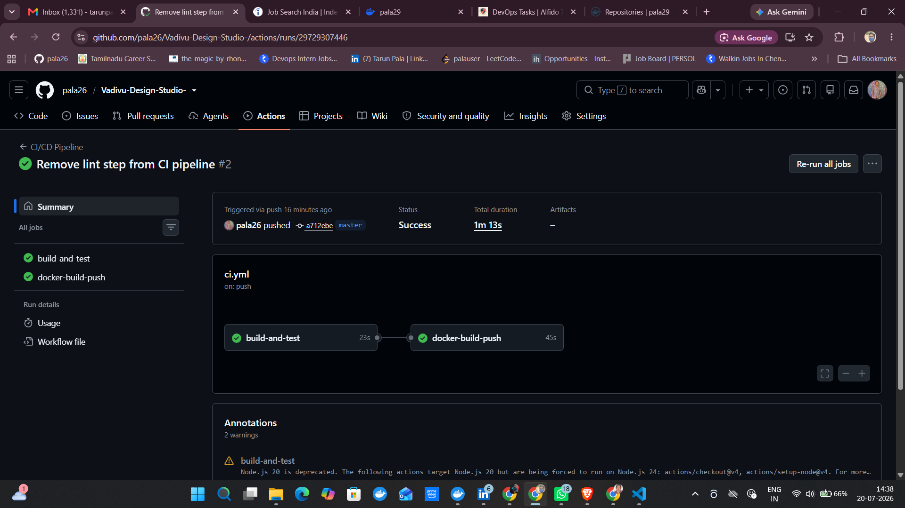
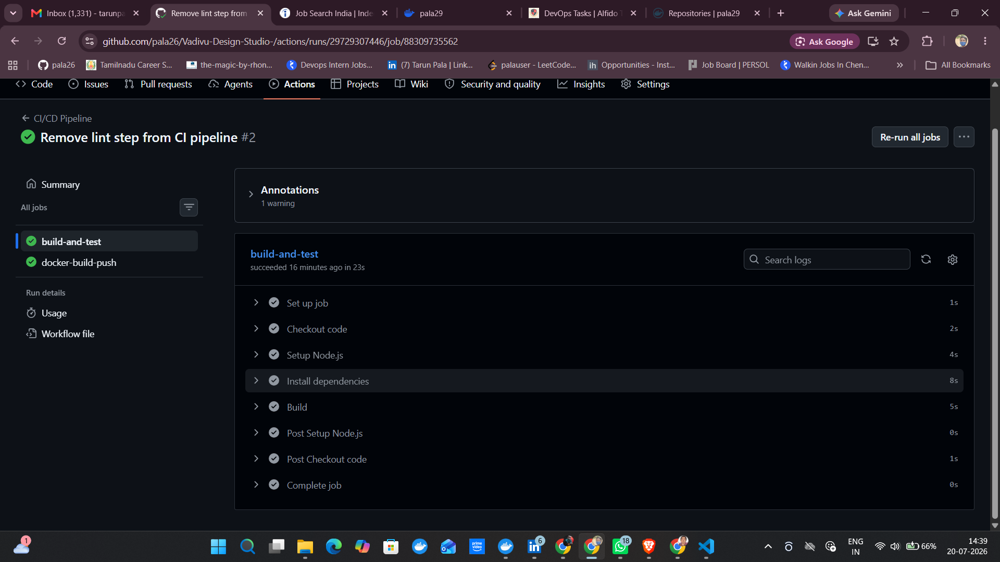
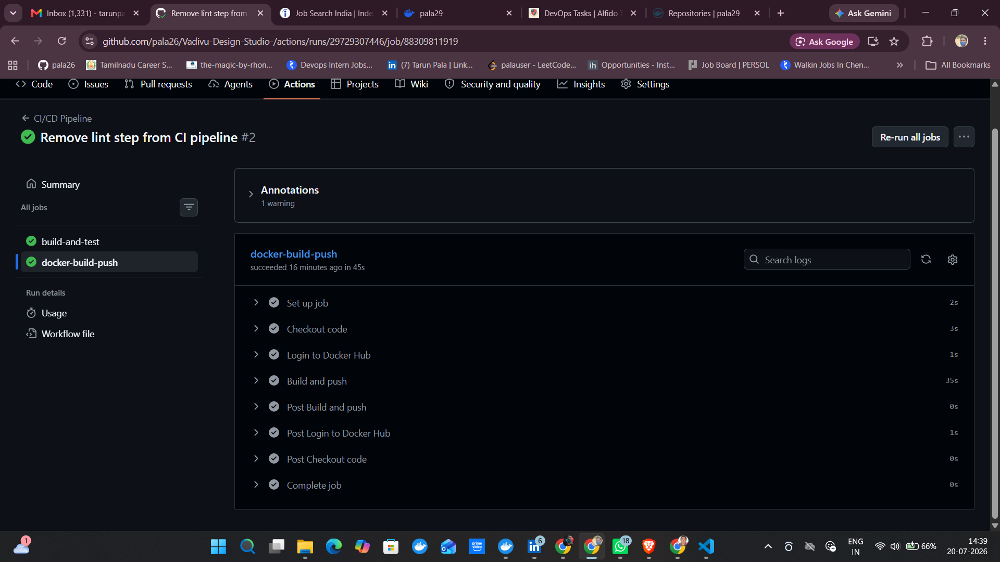
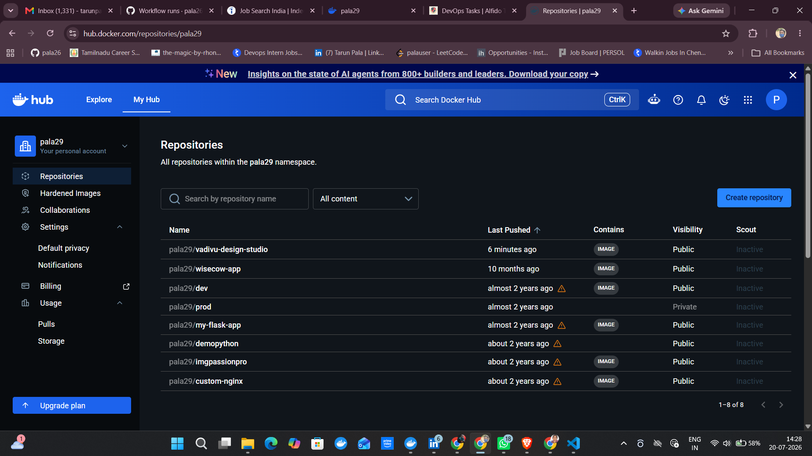

# Vadivu Design Studio — Design Agency Homepage

A Next.js 13+ (App Router) homepage built for the Next.js Developer Internship task.

## Tech stack

* Next.js 16 (App Router, `next/font`, `next/image`)
* React 19
* Tailwind CSS v4
* Plain JavaScript (no TypeScript), functional components only

## Project structure
app/
layout.js # Root layout, fonts, SEO metadata
page.js # Composes all sections
globals.css # Tailwind + design tokens (colors, fonts)
components/
Navbar.js
Hero.js
Services.js
Portfolio.js
Contact.js
Footer.js
public/
hero-graphic.svg
portfolio/*.jpg # Project artwork placeholders
Each homepage section (Hero, Services, Portfolio, Contact) is its own component for clarity and reuse, as requested in the task.

## Setup instructions
npm install
npm run dev

Then open `http://localhost:3000`.

To build for production:
npm run build
npm start

## Design notes

* Palette: warm paper background, near-black ink, terracotta clay accent, moss and gold secondary accents.
* Typography: Fraunces (display serif) for headings, Inter for body copy, JetBrains Mono for labels/eyebrows.
* Signature element: an oversized outlined "DIVU VADI" wordmark bleeding behind the hero headline.
* Images are served through `next/image` for optimization.

## Assumptions / additional features

* Portfolio links scroll to the Contact section in place of real case-study pages, since no backend/CMS was specified.
* The contact form performs client-side validation (required fields, email format) and shows an in-page success state. No backend endpoint is wired up; submission is simulated.
* SEO metadata (title, description, keywords, Open Graph) is set in `app/layout.js`.
* Built mobile-first and tested down to small mobile widths.

## Bonus items implemented

* Tailwind CSS
* Hover/scroll animations (image scale-up on hover, sticky navbar transition)
* SEO metadata
* `next/image` optimization for all artwork

---

# DevOps Internship Tasks — Alfido Tech

This section documents the DevOps tasks completed on top of the project above, as part of the Alfido Tech DevOps Internship.

## Task 1: Containerization — Dockerize the Web App

**Goal:** Containerize the Next.js app and run it using Docker.

**What was done:**
- Added `output: "standalone"` to `next.config.mjs` to produce a minimal, self-contained production build
- Wrote a multi-stage `Dockerfile`:
  - Stage 1 (`deps`) — installs dependencies with `npm ci`
  - Stage 2 (`builder`) — builds the app with `npm run build`
  - Stage 3 (`runner`) — copies only the standalone build output into a lean final image, runs as a non-root user
- Wrote `docker-compose.yml` to build and run the app as a single service (no database required — this app has no backend)
- Added `.dockerignore` to keep `node_modules`, `.git`, and `.next` out of the build context

**Commands used:**
```bash
docker compose up --build
```

App is then available at:
http://localhost:3000/

To check the container is running:
```bash
docker ps
```

To stop it:
```bash
docker compose down
```

**Files added:**
- `Dockerfile`
- `docker-compose.yml`
- `.dockerignore`

**Screenshots:**

*Container build and startup:*



*App running in browser at localhost:3000:*



*Container running (`docker ps` output):*



## Task 2: CI/CD Pipeline with GitHub Actions

**Goal:** Build an automated pipeline that builds, tests, and deploys the containerized app.

**What was done:**
- Created a GitHub Actions workflow at `.github/workflows/ci.yml` with two jobs:
  - `build-and-test` — checks out the code, sets up Node.js 20, installs dependencies with `npm ci`, and runs `npm run build`
  - `docker-build-push` — logs into Docker Hub, builds the Docker image using the Task 1 Dockerfile, and pushes it to Docker Hub
- The pipeline runs automatically on every push to `main`/`master` and on pull requests
- Docker Hub credentials are stored securely as GitHub repository secrets (`DOCKERHUB_USERNAME`, `DOCKERHUB_TOKEN`) rather than hardcoded
- First run failed due to a `next lint` CLI bug misinterpreting arguments in the CI environment; the lint step was removed and the pipeline succeeded on the next push

**Result:**
- Pipeline runs successfully, image pushed to: [hub.docker.com/r/pala29/vadivu-design-studio](https://hub.docker.com/r/pala29/vadivu-design-studio)

**Files added:**
- `.github/workflows/ci.yml`

**Screenshots:**

*All workflow runs (initial failed run, then successful run after fix):*



*Pipeline overview — both jobs succeeded:*



*build-and-test job — steps breakdown:*



*docker-build-push job — steps breakdown:*



*Docker image pushed to Docker Hub:*



---
